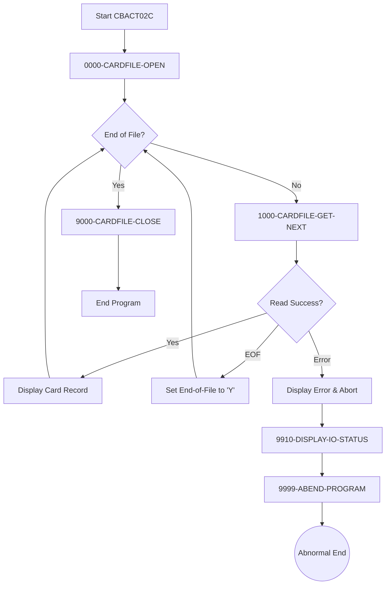

# Printing Card Data ([CBACT02C.cbl](./CBACT02C.cbl))

This COBOL program (CBACT02C) operates as a batch utility designed to process and display card-related data from an indexed VSAM file system, making it a crucial component for financial data management and auditing. The program sequentially reads through a database of card records, where each record consists of a 16-character card number and 134 characters of associated card data, displaying this information as it processes each record. From a business perspective, this utility serves essential functions in financial operations, such as audit trail generation, data verification, or report creation for card management systems. The program's robust error handling mechanisms and careful attention to file status reporting demonstrate its design for mission-critical financial environments where data accuracy and processing reliability are paramount, making it suitable for tasks like end-of-day reconciliation, compliance reporting, or card inventory management.

This flowchart illustrates a program called CBACT02C that handles card file processing operations. The program begins by opening a card file in the initialization phase (0000-CARDFILE-OPEN). It then enters a main processing loop that checks for end-of-file conditions. If the file isn't at its end, the program attempts to read the next card record (1000-CARDFILE-GET-NEXT). On successful reads, it displays the card record and continues the loop. When an EOF condition is encountered, it sets an end-of-file flag to 'Y' and returns to the main loop check. If any read errors occur, the program enters an error handling routine that displays the error, shows the I/O status (9910-DISPLAY-IO-STATUS), and terminates abnormally through the ABEND procedure (9999-ABEND-PROGRAM). When the end-of-file is reached, the program performs cleanup by closing the card file (9000-CARDFILE-CLOSE) and terminates normally. This appears to be a typical batch processing program, likely part of a larger financial or data processing system, designed to sequentially process card records while handling various success and error conditions appropriately.



### Main Processing Loop

This is the primary control flow of the program that orchestrates the entire card file reading process. It implements a classic sequential file processing pattern where records are read until the end of file is reached. The loop continues to execute as long as the end-of-file condition hasn't been met (END-OF-FILE = 'N'). For each iteration, it calls the card file reading routine and displays the record if successfully read. This block represents the main business logic that drives the program's primary function of reading and displaying card records.

```cobol
           PERFORM UNTIL END-OF-FILE = 'Y'                                      
               IF  END-OF-FILE = 'N'                                            
                   PERFORM 1000-CARDFILE-GET-NEXT                               
                   IF  END-OF-FILE = 'N'                                        
                       DISPLAY CARD-RECORD                                      
                   END-IF                                                       
               END-IF                                                           
           END-PERFORM.                                                         
```
---

### Card File Record Retrieval

This block handles the core functionality of reading records from the indexed VSAM file (CARDFILE). It implements comprehensive error handling for file operations, distinguishing between normal EOF conditions and actual errors. When a record is successfully read, it's moved into the CARD-RECORD structure. The routine uses a status code mechanism to communicate the outcome of the read operation back to the calling routine. It sets APPL-RESULT to 0 for successful reads, 16 for EOF conditions, and 12 for errors. This careful error handling ensures data integrity and proper program termination in case of file access issues.

```cobol
       1000-CARDFILE-GET-NEXT.                                                  
           READ CARDFILE-FILE INTO CARD-RECORD.                                 
           IF  CARDFILE-STATUS = '00'                                           
               MOVE 0 TO APPL-RESULT                                            
           ELSE                                                                 
               IF  CARDFILE-STATUS = '10'                                       
                   MOVE 16 TO APPL-RESULT                                       
               ELSE                                                             
                   MOVE 12 TO APPL-RESULT                                       
               END-IF                                                           
           END-IF                                                               
           IF  APPL-AOK                                                         
               CONTINUE                                                         
           ELSE                                                                 
               IF  APPL-EOF                                                     
                   MOVE 'Y' TO END-OF-FILE                                      
               ELSE                                                             
                   DISPLAY 'ERROR READING CARDFILE'                             
                   MOVE CARDFILE-STATUS TO IO-STATUS                            
                   PERFORM 9910-DISPLAY-IO-STATUS                               
                   PERFORM 9999-ABEND-PROGRAM                                   
               END-IF                                                           
           END-IF                                                               
           EXIT.                                                                
```
---

### File Initialization

This block manages the initialization of the card file for processing. It opens the VSAM file in INPUT mode and implements error handling for the open operation. The routine follows a consistent error handling pattern used throughout the program, setting APPL-RESULT to 0 for success and 12 for errors. This initialization is crucial as it establishes the file connection that will be used throughout the program's execution. If the file cannot be opened, the program will terminate with appropriate error messaging, ensuring that processing doesn't continue with an invalid file state.

```cobol
       0000-CARDFILE-OPEN.                                                      
           MOVE 8 TO APPL-RESULT.                                               
           OPEN INPUT CARDFILE-FILE                                             
           IF  CARDFILE-STATUS = '00'                                           
               MOVE 0 TO APPL-RESULT                                            
           ELSE                                                                 
               MOVE 12 TO APPL-RESULT                                           
           END-IF                                                               
           IF  APPL-AOK                                                         
               CONTINUE                                                         
           ELSE                                                                 
               DISPLAY 'ERROR OPENING CARDFILE'                                 
               MOVE CARDFILE-STATUS TO IO-STATUS                                
               PERFORM 9910-DISPLAY-IO-STATUS                                   
               PERFORM 9999-ABEND-PROGRAM                                       
           END-IF                                                               
           EXIT.                                                                
```
---

### File Cleanup

This block handles the proper termination of file operations by closing the CARDFILE. It follows the program's standardized error handling pattern, using APPL-RESULT to track the operation's success or failure. The block ensures proper resource cleanup at program termination, which is crucial for maintaining data integrity and system resource management. If the close operation fails, the program abends with appropriate error information, preventing any potential file corruption or system resource leaks.

```cobol
       9000-CARDFILE-CLOSE.                                                     
           ADD 8 TO ZERO GIVING APPL-RESULT.                                    
           CLOSE CARDFILE-FILE                                                  
           IF  CARDFILE-STATUS = '00'                                           
               SUBTRACT APPL-RESULT FROM APPL-RESULT                            
           ELSE                                                                 
               ADD 12 TO ZERO GIVING APPL-RESULT                                
           END-IF                                                               
           IF  APPL-AOK                                                         
               CONTINUE                                                         
           ELSE                                                                 
               DISPLAY 'ERROR CLOSING CARDFILE'                                 
               MOVE CARDFILE-STATUS TO IO-STATUS                                
               PERFORM 9910-DISPLAY-IO-STATUS                                   
               PERFORM 9999-ABEND-PROGRAM                                       
           END-IF                                                               
           EXIT.                                                                
```

### Summary

This COBOL program (CBACT02C) is designed to read and display card data from an indexed VSAM file. The program follows a straightforward but robust structure for batch processing of card records. It begins by opening the card file, then enters a main processing loop that sequentially reads records until reaching the end of file, displaying each record as it's read. The program implements comprehensive error handling throughout all file operations, with specific status codes and error messages for different scenarios. It uses a consistent error handling pattern across all file operations (open, read, close) and includes proper file cleanup on termination. The program is part of a larger CardDemo application and appears to be designed for debugging or verification purposes, as it simply displays the card records without performing any transformations or updates to the data.
